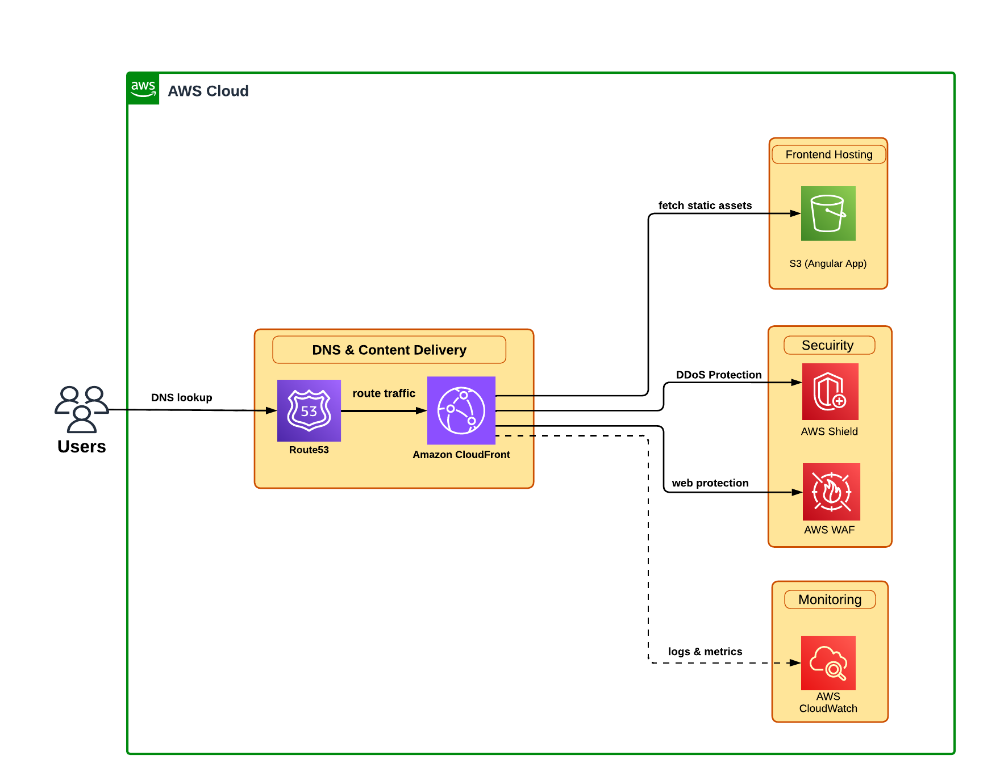

# AWS INFRASTRUCTURE ARCHITECTURE

This document outlines the AWS infrastructure setup for the Event Planner Frontend application. The architecture is designed to ensure scalability, reliability, security, and optimal performance for a global user base.

## Overview

The Event Planner Frontend is a static Angular application hosted on AWS using a serverless architecture. This approach eliminates server management overhead, provides automatic scaling, and ensures high availability while maintaining cost efficiency. The infrastructure leverages AWS managed services to deliver a robust, secure, and performant web application.

## Architecture Diagram

## AWS Services & Justification

### 1. Amazon S3 (Simple Storage Service)

**Purpose:** Static website hosting for the Angular application

**Why S3?**
- **Cost-Effective:** Pay only for storage used, no server costs
- **Durability:** 99.999999999% (11 9's) durability ensures data safety
- **Scalability:** Automatically scales to handle any amount of traffic
- **Static Hosting:** Perfect for Single Page Applications (SPAs) like Angular
- **Versioning:** Supports versioning for rollback capabilities
- **Integration:** Seamlessly integrates with CloudFront for content delivery

**Configuration:**
- Bucket configured for static website hosting
- Public read access via bucket policy (restricted to CloudFront)
- Versioning enabled for deployment history
- Server-side encryption enabled for data at rest

### 2. Amazon CloudFront

**Purpose:** Content Delivery Network (CDN) for global content distribution

**Why CloudFront?**
- **Global Performance:** 450+ edge locations worldwide reduce latency
- **Caching:** Reduces load on S3 and improves response times
- **HTTPS/SSL:** Free SSL/TLS certificates via AWS Certificate Manager
- **Security:** Origin Access Identity (OAI) restricts direct S3 access
- **Cost Optimization:** Reduces data transfer costs from S3
- **Custom Domain:** Supports custom domain names with Route 53
- **Compression:** Automatic gzip/brotli compression for faster transfers
- **Edge Computing:** Lambda@Edge for request/response manipulation

**Configuration:**
- Origin: S3 bucket with Origin Access Identity
- Default root object: index.html
- Error pages: Custom 404/403 redirects to index.html (SPA routing)
- Cache behavior: Optimized for static assets with TTL settings
- Compression: Enabled for text-based files
- HTTP to HTTPS redirect enforced

### 3. Amazon Route 53

**Purpose:** DNS management and domain routing

**Why Route 53?**
- **High Availability:** 100% availability SLA
- **Low Latency:** Global anycast network for fast DNS resolution
- **Health Checks:** Monitor endpoint health and route accordingly
- **Traffic Management:** Supports routing policies (geolocation, latency-based)
- **AWS Integration:** Native integration with CloudFront and other AWS services
- **Domain Registration:** Can register and manage domains
- **DNSSEC:** Support for DNS security extensions

**Configuration:**
- A/AAAA records pointing to CloudFront distribution
- Alias records for apex domain support
- Health checks for monitoring
- TTL optimization for DNS caching

### 4. AWS WAF (Web Application Firewall)

**Purpose:** Protect against common web exploits and attacks

**Why WAF?**
- **Security:** Protects against OWASP Top 10 vulnerabilities
- **Rate Limiting:** Prevents abuse and DDoS attacks
- **Geo-Blocking:** Restrict access by geographic location if needed
- **Custom Rules:** Create rules based on IP, headers, body, or URI
- **Managed Rules:** AWS and third-party managed rule sets
- **Real-time Monitoring:** Visibility into web traffic patterns
- **Bot Control:** Identify and block malicious bots

**Configuration:**
- Attached to CloudFront distribution
- AWS Managed Rules for common threats
- Rate-based rules to prevent abuse
- IP reputation lists
- Custom rules for application-specific threats

### 5. AWS Shield Standard

**Purpose:** DDoS protection for the application

**Why Shield?**
- **Automatic Protection:** Enabled by default at no extra cost
- **Network Layer:** Protects against Layer 3/4 DDoS attacks
- **Always-On:** Continuous monitoring and mitigation
- **CloudFront Integration:** Seamless protection for CDN traffic
- **No Performance Impact:** Inline mitigation without latency

**Note:** Shield Standard is automatically enabled. Shield Advanced can be added for enhanced protection and 24/7 DDoS Response Team (DRT) support.

### 6. AWS CloudWatch

**Purpose:** Monitoring, logging, and observability

**Why CloudWatch?**
- **Centralized Logging:** Aggregates logs from all AWS services
- **Metrics:** Track performance metrics (requests, errors, latency)
- **Alarms:** Automated alerts for anomalies or thresholds
- **Dashboards:** Visual representation of application health
- **Cost Monitoring:** Track infrastructure costs
- **Troubleshooting:** Debug issues with detailed logs
- **Retention:** Configurable log retention policies

**Monitored Metrics:**
- CloudFront: Requests, bytes transferred, error rates, cache hit ratio
- S3: Bucket size, number of objects, request metrics
- WAF: Blocked requests, allowed requests, rule matches
- Custom metrics: Application-specific KPIs

**Alarms Configured:**
- High error rate (4xx/5xx responses)
- Unusual traffic patterns
- Low cache hit ratio
- High data transfer costs

## Architecture Benefits

### Scalability
- **Automatic Scaling:** All services scale automatically without manual intervention
- **Global Reach:** CloudFront edge locations serve users from nearest location
- **No Capacity Planning:** No need to provision servers or predict traffic

### Reliability
- **High Availability:** Multi-AZ redundancy across all services
- **Fault Tolerance:** Automatic failover and recovery
- **99.99% Uptime:** CloudFront SLA ensures high availability

### Security
- **Defense in Depth:** Multiple layers of security (WAF, Shield, encryption)
- **Encryption:** Data encrypted in transit (HTTPS) and at rest (S3)
- **Access Control:** IAM policies and S3 bucket policies restrict access
- **Compliance:** Meets industry standards (SOC, PCI DSS, HIPAA)

### Performance
- **Low Latency:** Edge caching reduces response times to <100ms globally
- **Compression:** Reduces payload size by 60-80%
- **HTTP/2:** Modern protocol support for faster page loads
- **Caching Strategy:** Optimized TTLs for static assets

### Cost Efficiency
- **Serverless:** No idle server costs, pay only for usage
- **Free Tier:** S3, CloudFront, and CloudWatch offer free tier benefits
- **Caching:** Reduces origin requests and data transfer costs
- **Reserved Capacity:** Option to commit for additional savings

## Deployment Flow

1. **Build:** Angular application compiled to static files
2. **Upload:** Build artifacts uploaded to S3 bucket
3. **Invalidation:** CloudFront cache invalidated for updated files
4. **Propagation:** Changes propagate to edge locations (5-10 minutes)
5. **Verification:** Health checks confirm successful deployment

## Security Best Practices

- S3 bucket not publicly accessible (CloudFront OAI only)
- HTTPS enforced for all connections
- Security headers configured (CSP, HSTS, X-Frame-Options)
- Regular security audits via AWS Security Hub
- IAM roles follow least privilege principle
- MFA enabled for AWS console access
- CloudTrail enabled for audit logging

## Monitoring & Alerting

### Key Metrics
- Request count and error rates
- Cache hit ratio (target: >85%)
- Average response time (target: <200ms)
- Data transfer volume
- WAF blocked requests

### Alerts
- Email/SMS notifications for critical issues
- Slack/Teams integration for team notifications
- PagerDuty integration for on-call escalation

## Cost Optimization

- CloudFront caching reduces S3 requests
- Compression reduces data transfer costs
- S3 Intelligent-Tiering for infrequently accessed objects
- CloudWatch log retention policies
- Regular cost analysis via AWS Cost Explorer

## Disaster Recovery

- **RTO (Recovery Time Objective):** <15 minutes
- **RPO (Recovery Point Objective):** <5 minutes
- S3 versioning enables quick rollback
- Cross-region replication for critical data
- Automated backups of infrastructure as code
- Regular disaster recovery drills

## Future Enhancements

- **AWS Amplify:** Consider for simplified CI/CD and hosting
- **Lambda@Edge:** Add for dynamic content generation
- **AWS Shield Advanced:** Enhanced DDoS protection for critical periods
- **CloudFront Functions:** Lightweight edge computing for simple transformations
- **S3 Transfer Acceleration:** Faster uploads for global teams
- **AWS Global Accelerator:** Additional performance optimization

## Conclusion

This AWS infrastructure provides a robust, scalable, and secure foundation for the Event Planner Frontend application. The serverless architecture eliminates operational overhead while ensuring high performance and availability for users worldwide. Each service is carefully selected to address specific requirements while maintaining cost efficiency and following AWS best practices.